# SecOps Nexus - Deployment Flow

```mermaid
flowchart TD
    Start([Start Deployment]) --> Init[Environment Init<br/>Enable GCP APIs]
    
    Init --> CloudSQL[Cloud SQL<br/>PostgreSQL 16]
    
    CloudSQL --> DBCreate[Create Database<br/>& User]
    
    DBCreate --> LoadSchema[Load Schema<br/>& Seed Data]
    
    LoadSchema --> Secrets[Secret Manager<br/>Store Secrets]
    
    Secrets --> SA[Create Service<br/>Account]
    
    SA --> IAM[Grant IAM<br/>Roles]
    
    IAM --> Registry[Artifact<br/>Registry]
    
    Registry --> Build[Cloud Build<br/>Push Image]
    
    Build --> BuildCheck{Build<br/>Success?}
    
    BuildCheck -->|Success| Deploy[Cloud Run<br/>Deploy]
    
    Deploy --> DeployCheck{Deploy<br/>Success?}
    
    DeployCheck -->|Success| Health[Health<br/>Check]
    
    Health --> HealthCheck{Health<br/>OK?}
    
    HealthCheck -->|OK| Invoker[Grant IAM<br/>Invoker]
    
    Invoker --> Register[Register with<br/>Layer 1]
    
    Register --> Wait[Wait for<br/>Approval]
    
    Wait --> Access[Access Gemini<br/>Enterprise]
    
    Access --> TestTools[Test MCP<br/>Tools]
    
    TestTools --> Verify{Tools<br/>Working?}
    
    Verify -->|Success| Complete([Production<br/>Ready])
    
    style Start fill:#FFD4E5,stroke:#333,stroke-width:2px,color:#000
    style Init fill:#C2E0FF,stroke:#333,stroke-width:2px,color:#000
    style CloudSQL fill:#C2E0FF,stroke:#333,stroke-width:2px,color:#000
    style DBCreate fill:#D4EDFF,stroke:#333,stroke-width:2px,color:#000
    style LoadSchema fill:#D4EDFF,stroke:#333,stroke-width:2px,color:#000
    style Secrets fill:#F3D4FF,stroke:#333,stroke-width:2px,color:#000
    style SA fill:#C2E0FF,stroke:#333,stroke-width:2px,color:#000
    style IAM fill:#D4EDFF,stroke:#333,stroke-width:2px,color:#000
    style Registry fill:#C2E0FF,stroke:#333,stroke-width:2px,color:#000
    style Build fill:#C2E0FF,stroke:#333,stroke-width:2px,color:#000
    style BuildCheck fill:#FFF4CC,stroke:#333,stroke-width:2px,color:#000
    style Deploy fill:#C2E0FF,stroke:#333,stroke-width:2px,color:#000
    style DeployCheck fill:#FFF4CC,stroke:#333,stroke-width:2px,color:#000
    style Health fill:#D4EDFF,stroke:#333,stroke-width:2px,color:#000
    style HealthCheck fill:#FFF4CC,stroke:#333,stroke-width:2px,color:#000
    style Invoker fill:#F3D4FF,stroke:#333,stroke-width:2px,color:#000
    style Register fill:#E8DAFF,stroke:#333,stroke-width:2px,color:#000
    style Wait fill:#FFECB3,stroke:#333,stroke-width:2px,color:#000
    style Access fill:#E8DAFF,stroke:#333,stroke-width:2px,color:#000
    style TestTools fill:#D4EDFF,stroke:#333,stroke-width:2px,color:#000
    style Verify fill:#FFF4CC,stroke:#333,stroke-width:2px,color:#000
    style Complete fill:#C8F7C5,stroke:#333,stroke-width:2px,color:#000
```



## Deployment Phase Summary

### Phase 1: Environment Setup
- Set GCP project variables (`PROJECT_ID`, `REGION`)
- Enable required APIs (Cloud Run, Cloud SQL, Secret Manager, Artifact Registry)

### Phase 2: Cloud SQL Provisioning
- Create PostgreSQL 16 instance (db-f1-micro)
- Create database: `security_connector`
- Create user: `connector` with strong password
- Get Cloud SQL connection name

### Phase 3: Load Database
- Upload `schema.sql` and `seed.sql` via Cloud Shell
- Load 5 tables (roles, users, projects, findings, audit_logs)
- Verify 18 findings seeded

### Phase 4: Secret Manager
Store 3 secrets:
- `connector-jwt-secret` (32-byte hex)
- `connector-db-password` (generated password)
- `connector-user-role-map` (email:ROLE pairs)

### Phase 5: Service Account & IAM
- Create service account: `connector-sa`
- Grant roles:
  - `roles/cloudsql.client` (database access)
  - `roles/secretmanager.secretAccessor` (secrets access)

### Phase 6: Build & Push Container
- Create Artifact Registry repository
- Run Cloud Build: `gcloud builds submit --tag IMAGE_URL`
- Verify build success

### Phase 7: Cloud Run Deployment
Deploy with flags:
- `--no-allow-unauthenticated` (EPAM mandatory)
- `--add-cloudsql-instances` (Unix socket connection)
- `--set-secrets` (inject from Secret Manager)
- `--service-account` (connector-sa)
- Verify health check: `GET /health`

### Phase 8: IAM Invoker Binding
Grant `roles/run.invoker` to Gemini Enterprise service account:
```
service-71784361107@gcp-sa-discoveryengine.iam.gserviceaccount.com
```

### Phase 9: Layer 1 Registration
- Submit MS Teams ticket with:
  - Service URL
  - Project ID & Number
  - MCP endpoint: `/mcp`
  - OpenAPI spec: `/openapi.json`
- Wait for Platform Admin approval

### Phase 10: Testing
- Access Gemini Enterprise at `epa.ms/gemini-enterprise`
- Test all 5 MCP tools
- Verify read/write operations
- Check audit logs

---

## Key Decision Points

| Checkpoint | Success Criteria | Failure Action |
|------------|-----------------|----------------|
| **Build Success** | Docker image pushed to registry | Check Dockerfile, dependencies, logs |
| **Deploy Success** | Cloud Run service running | Check env vars, secrets, IAM roles |
| **Health Check** | `/health` returns 200 | Check Cloud Run logs, database connection |
| **Tools Working** | All 5 MCP tools callable from Gemini | Check IAM bindings, JWT generation, RBAC |

---

## Critical Compliance Requirements

⚠️ **Must use** `--no-allow-unauthenticated` (EPAM policy)  
⚠️ **Must grant** invoker role to Gemini service account  
⚠️ **Must inject** secrets via Secret Manager (not plain env vars)  
⚠️ **Must stay** within $100 USD budget cap

---

## Quick Verification Commands

```bash
# Health check (OIDC token)
curl -H "Authorization: Bearer $(gcloud auth print-identity-token)" $SERVICE_URL/health

# OpenAPI spec
curl -H "Authorization: Bearer $(gcloud auth print-identity-token)" $SERVICE_URL/openapi.json

# View logs
gcloud run services logs read $SERVICE_NAME --region=$REGION --limit=50

# Check IAM bindings
gcloud run services get-iam-policy $SERVICE_NAME --region=$REGION
```
