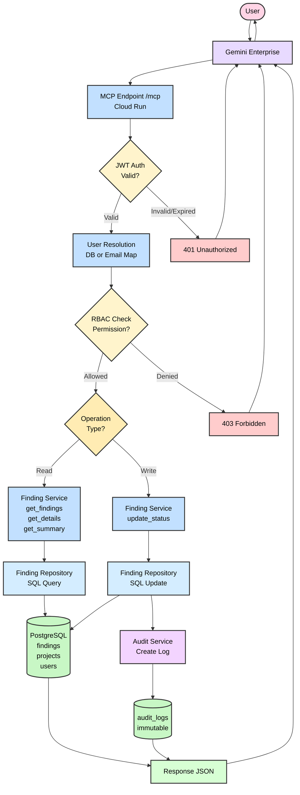

# SecOps Nexus - Architecture Flow

## Key Components

### Entry Point
- **User**: Security engineer/viewer/admin
- **Gemini Enterprise**: AI layer at epa.ms/gemini-enterprise
- **MCP Endpoint**: FastMCP server at `/mcp` on Cloud Run

### Security Layer
- **JWT Auth**: HS256 signature validation, expiry check
- **User Resolution**: DB lookup or email-to-role mapping via `USER_ROLE_MAP`
- **RBAC Check**: 3 roles (VIEWER, SECURITY_ENGINEER, SECURITY_ADMIN)

### Service Layer
- **Read Operations**: `get_security_findings`, `get_finding_details`, `get_security_summary`, `get_finding_audit_history`
- **Write Operations**: `update_finding_status` (ENGINEER/ADMIN only)

### Data Layer
- **Finding Repository**: SQLAlchemy async queries
- **PostgreSQL**: 5 tables (findings, projects, users, roles, audit_logs)
- **Audit Service**: Immutable audit trail for every write

### Response
- JSON response with finding data or audit confirmation
- Returns to Gemini → User

---

## 5 MCP Tools

| Tool | Type | Min Role |
|------|------|----------|
| `get_security_findings` | Read | VIEWER |
| `get_finding_details` | Read | VIEWER |
| `get_security_summary` | Read | VIEWER |
| `get_finding_audit_history` | Read | VIEWER |
| `update_finding_status` | Write | SECURITY_ENGINEER |

---

## Error Paths

- **401 Unauthorized**: Invalid/expired/tampered JWT
- **403 Forbidden**: Valid JWT but insufficient role permissions
- **404 Not Found**: Finding/project doesn't exist
- **422 Unprocessable**: Invalid status value (must be OPEN/IN_PROGRESS/RESOLVED)
